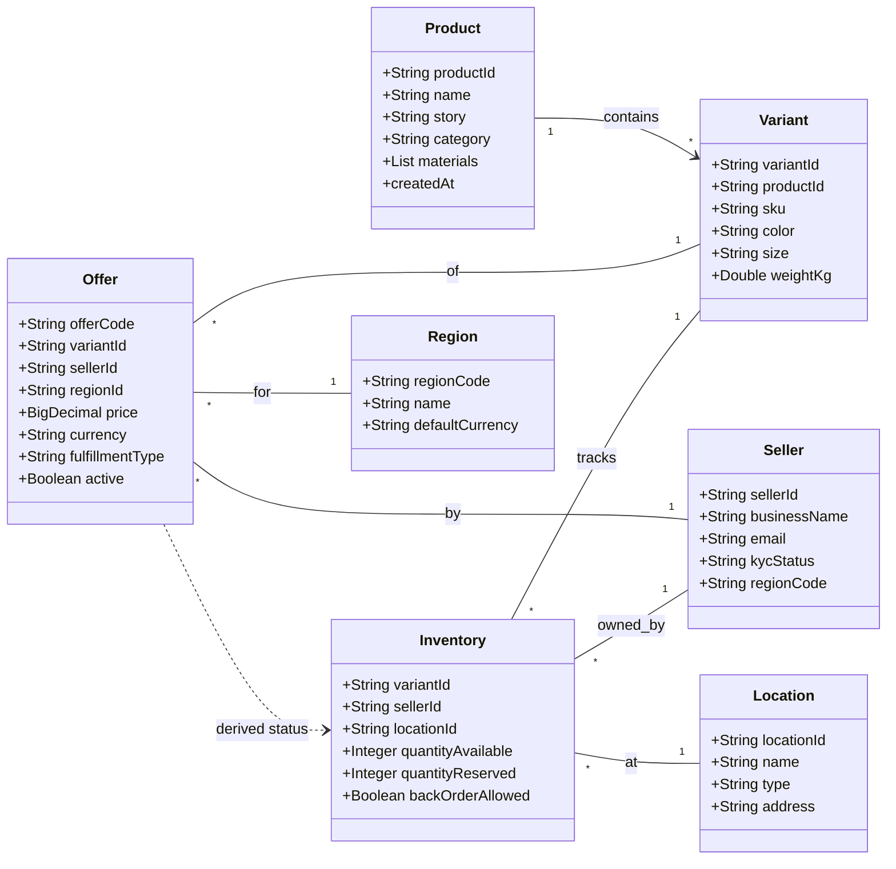

# Handmade Platform - DDD Entity Architecture

This diagram visualizes the core entity relationships after the Phase 10 refactoring. The architecture is **Offer-Centric** and supports **Multi-Region** pricing and **Multi-Location** inventory.

## Key Architectural Concepts

### 1. The Global Product (ASIN Layer)
`Product` and `Variant` represent the **Single Point of Truth** for what an item *is*. This data is global and does not change based on where it is sold.

### 2. The Commercial Offer (SKU Layer)
The `Offer` is the most important commercial entity. It defines a **Seller's Proposition** for a `Variant` in a specific `Region`. This allows:
- **Regional Pricing**: Selling the same item for \$50 in the US and ₹4000 in India.
- **Multi-Sourcing**: Multiple artisans selling the same design (Variant) at different price points.

### 3. The Physical Inventory
`Inventory` is decoupled from the `Offer` to support complex logistics. Stock is tracked per `Location`, meaning a seller can have inventory in their own studio AND in a regional fulfillment center.

### 4. Bounded Context Separation
- **Product Context**: Owns `Product` and `Variant`.
- **Offer Context**: Owns `Offer` and `Region`.
- **Inventory Context**: Owns `Inventory` and `Location`.

These contexts communicate via events (e.g., `StockUpdatedEvent`) to ensure loose coupling and horizontal scalability.
