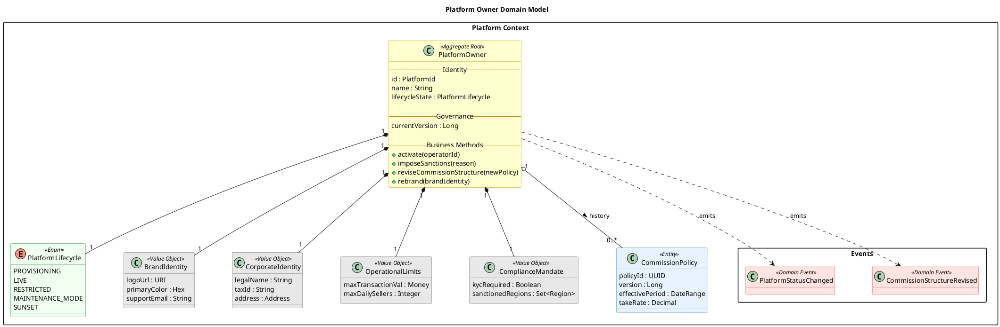

# Platform Governance Domain Guide

This document explains the Domain-Driven Design (DDD) model for the **Platform Owner** aggregate.
This model encapsulates all governance, lifecycle, and consistency rules for the "Handmade" marketplace.

## 1. Core Structure

### Aggregate Root: `PlatformOwner`
**Usefulness:**
*   **Single Source of Truth**: It is the only entity allowed to change the global state of the marketplace.
*   **Consistency Boundary**: Ensures that conflicting rules (e.g., "Enable Checkout" vs. "No Payment Gateway Configured") cannot exist simultaneously.
*   **Lifecycle Manager**: Controls the operational state (Provisioning -> Live -> Sunset) to prevent illegal operations (e.g., onboarding sellers during a shutdown).

### Lifecycle: `PlatformLifecycle` (Enum)
**Usefulness:**
*   **Operational Safety**: Explicitly defines states (`PROVISIONING`, `LIVE`, `RESTRICTED`, `MAINTENANCE_MODE`, `SUNSET`).
*   **Governance**: Prevents "write" operations when the platform is in a read-only state (Sunset/Maintenance).

## 2. Value Objects (Immutable Configuration)

These objects represent "snapshots" of configuration. If a rule changes, we replace the entire object.

| Class | Description | Business Value |
| :--- | :--- | :--- |
| **`BrandIdentity`** | Visual assets (Logo, Favicon, Colors). | **White-Labeling**: Allows the platform to change its "skin" instantly without code changes. |
| **`CorporateIdentity`** | Legal name, Tax ID, Address. | **Invoicing & Compliance**: Ensures every invoice generated has the correct legal entity details for that point in time. |
| **`OperationalLimits`** | Rate limits, Max Transactions. | **Risk Management**: Hard stops for fraud prevention (e.g., "No transaction over $5k"). |
| **`ComplianceMandate`** | Rules for KYC, Tax, Regions. | **Legal Safety**: Defines *where* we operate and *who* can join (e.g., "Block users from Country X"). |
| **`LocalizationPolicy`** | Currency, Timezone, Locale. | **Global Reach**: Defines the "native" feel of the marketplace for users. |

## 3. Sub-Entities (Versioning)

These concepts change over time, and history is critical.

| Class | Description | Business Value |
| :--- | :--- | :--- |
| **`CommissionPolicy`** | Take Rates, Flat Fees. | **Monetization**: Tracks *what* we charged at any point in history. "Order #123 used Policy v2". |
| **`FeatureConfiguration`** | Toggles for experimental features. | **Rollout Safety**: Allows specific features (e.g., "Gift Cards") to be enabled/disabled instantly. |

## 4. Domain Events

Events represent *what happened*. They decouple the side effects (Audit Logs, Notifications).

*   **`PlatformStatusChanged`**: Emitted when the platform goes Live, Restricted, or Sunset.
*   **`CommissionStructureRevised`**: Emitted when fees are changed. Downstream services (Billing) listen to this to update their calculators.
*   **`PlatformLockdownInitiated`**: Emitted during emergency stoppage.

---

## 5. Visual Domain Model (PlantUML)

