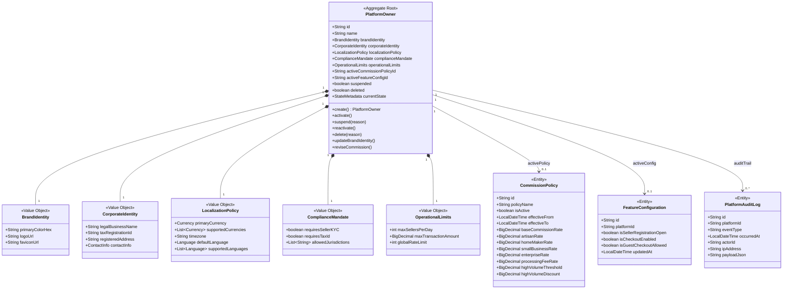
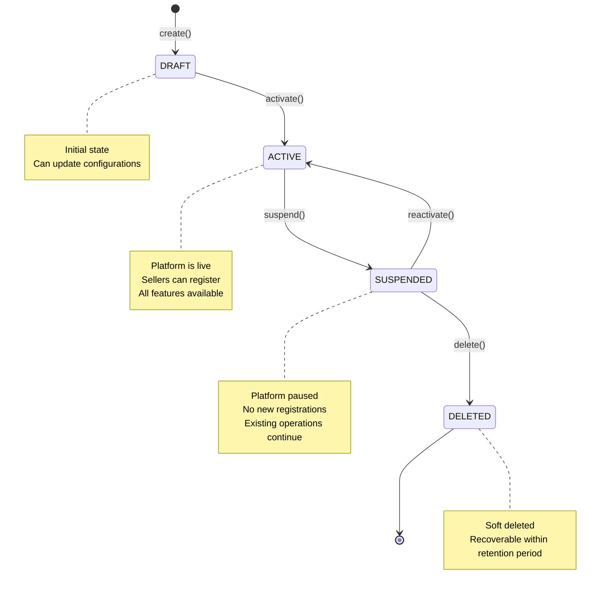
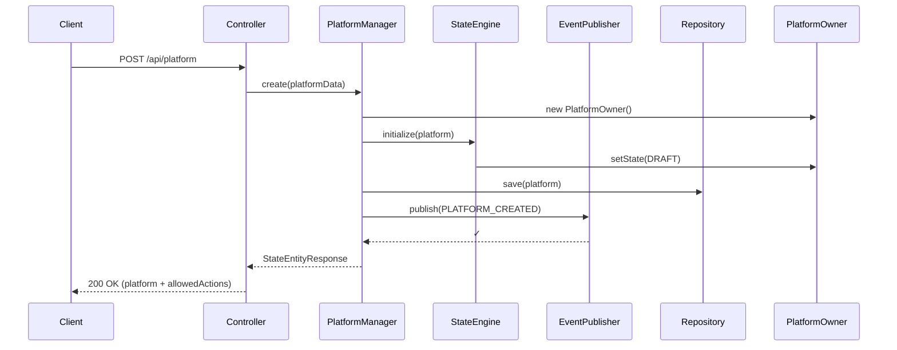
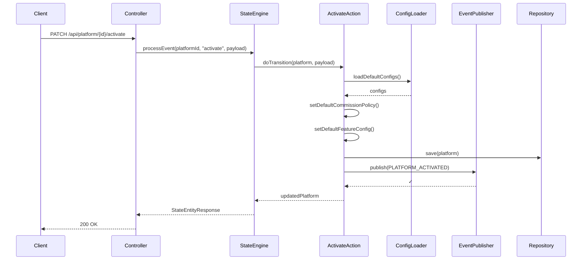
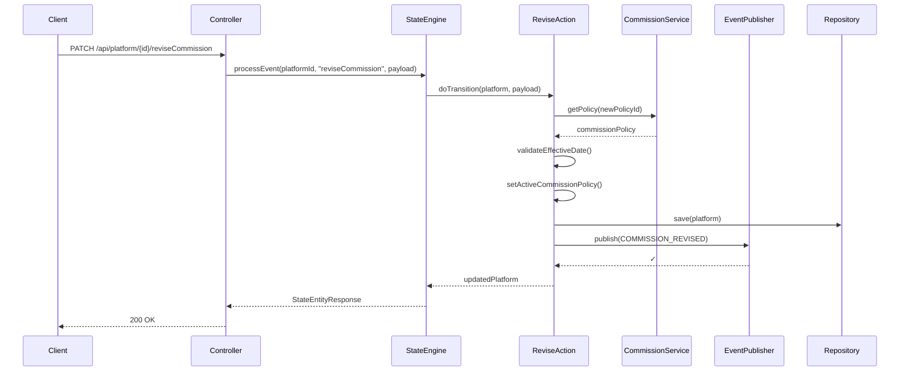
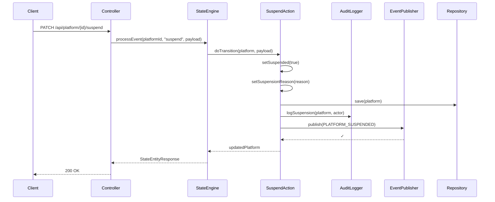

# Platform Management Module - Architecture Documentation

## Overview

The **Platform Management** module is responsible for managing the lifecycle and configuration of marketplace platforms. It follows Domain-Driven Design (DDD) principles and uses Chenile's state machine framework for workflow management.

## What's Implemented

### ✅ Core Features

1. **Platform Lifecycle Management**
   - Create platform configurations
   - Activate platforms for seller onboarding
   - Suspend platforms for maintenance
   - Reactivate suspended platforms
   - Soft delete platforms

2. **Configuration Management**
   - **Brand Identity**: Logo, colors, favicon
   - **Corporate Identity**: Legal name, tax ID, address
   - **Localization**: Currencies, languages, timezones
   - **Compliance Rules**: KYC requirements, tax ID requirements, jurisdictions
   - **Operational Limits**: Max sellers/day, transaction limits, rate limits

3. **Commission Management**
   - Multiple commission policies
   - Seller-type specific rates (Artisan, Home Maker, Small Business, Enterprise)
   - Volume-based discounts
   - Time-bound policy activation

4. **Feature Flags**
   - Seller registration toggle
   - Checkout enablement
   - Guest checkout control

5. **Audit Logging**
   - Complete audit trail of all platform changes
   - Actor tracking
   - Timestamp and IP address logging

---

## Module Structure

```
handmade-platform-management/
├── platform-api/           # DTOs, Commands, Service Interfaces
├── platform-domain/        # Domain Model, Aggregates, Value Objects
├── platform-service/       # Business Logic, State Machine Actions
├── platform-delegate/      # Remote Client for Platform Manager
└── platform-infrastructure/ # (Future) Controllers, Repositories
```

---

## Domain Model

### Class Diagram



---

## State Machine

### State Diagram



### Allowed Actions by State

| State | Allowed Actions |
|-------|----------------|
| `DRAFT` | `activate`, `updateBrandIdentity`, `updateCorporateIdentity` |
| `ACTIVE` | `suspend`, `updateBrandIdentity`, `updateCorporateIdentity`, `reviseCommission`, `updateFeatureConfig`, `updateOperationalLimits` |
| `SUSPENDED` | `reactivate`, `delete`, `updateBrandIdentity`, `updateCorporateIdentity`, `reviseCommission`, `updateFeatureConfig` |
| `DELETED` | *(terminal state - no actions)* |

---

## Key Workflows

### 1. Platform Creation Flow



### 2. Platform Activation Flow



### 3. Commission Revision Flow



### 4. Platform Suspension Flow



---

## Architecture Patterns

### 1. Domain-Driven Design (DDD)

- **Aggregate Root**: `PlatformOwner` - maintains consistency boundaries
- **Value Objects**: `BrandIdentity`, `CorporateIdentity`, `LocalizationPolicy`, etc.
- **Entities**: `CommissionPolicy`, `FeatureConfiguration`, `PlatformAuditLog`
- **Domain Services**: `PlatformManager`, `CommissionService`

### 2. State Machine Pattern

- Uses Chenile's `StateEntityService` for workflow management
- All state transitions are explicit and validated
- Each state transition has a corresponding action class
- State changes trigger domain events

### 3. Event-Driven Architecture

- All state changes publish domain events
- Events contain full context (before/after state, actor, timestamp)
- Supports both InVM and Queue-based event publishing
- Enables async processing and integration with other modules

### 4. Repository Pattern

- `PlatformRepository` for aggregate persistence
- `CommissionPolicyRepository` for commission management
- JPA-based with Spring Data
- Supports multi-tenancy via tenant field

---

## API Endpoints

### Platform Lifecycle

| Method | Endpoint | Description | State Transition |
|--------|----------|-------------|-----------------|
| `POST` | `/api/platform` | Create new platform | → `DRAFT` (auto-activates to `ACTIVE`) |
| `GET` | `/api/platform/{id}` | Get platform details | *(no transition)* |
| `PATCH` | `/api/platform/{id}/activate` | Activate platform | `DRAFT` → `ACTIVE` |
| `PATCH` | `/api/platform/{id}/suspend` | Suspend platform | `ACTIVE` → `SUSPENDED` |
| `PATCH` | `/api/platform/{id}/reactivate` | Reactivate platform | `SUSPENDED` → `ACTIVE` |
| `PATCH` | `/api/platform/{id}/delete` | Soft delete platform | `SUSPENDED` → `DELETED` |

### Configuration Management

| Method | Endpoint | Description | Valid States |
|--------|----------|-------------|-------------|
| `PATCH` | `/api/platform/{id}/updateBrandIdentity` | Update branding | `DRAFT`, `ACTIVE`, `SUSPENDED` |
| `PATCH` | `/api/platform/{id}/updateCorporateIdentity` | Update legal info | `DRAFT`, `ACTIVE`, `SUSPENDED` |
| `PATCH` | `/api/platform/{id}/reviseCommission` | Change commission policy | `ACTIVE`, `SUSPENDED` |
| `PATCH` | `/api/platform/{id}/updateFeatureConfig` | Toggle features | `ACTIVE`, `SUSPENDED` |
| `PATCH` | `/api/platform/{id}/updateOperationalLimits` | Update limits | `ACTIVE`, `SUSPENDED` |

---

## Domain Events

All events extend `PlatformEvent` and include:
- `platformId`: The platform identifier
- `occurredAt`: Event timestamp
- `actorId`: User who triggered the event
- `eventType`: Type of event
- `payload`: Event-specific data

### Event Types

1. **PLATFORM_CREATED** - Platform initially created
2. **PLATFORM_ACTIVATED** - Platform activated for use
3. **PLATFORM_SUSPENDED** - Platform temporarily suspended
4. **PLATFORM_REACTIVATED** - Platform resumed after suspension
5. **PLATFORM_DELETED** - Platform soft deleted
6. **BRAND_UPDATED** - Brand identity changed
7. **CORPORATE_IDENTITY_UPDATED** - Legal information changed
8. **COMMISSION_REVISED** - Commission policy updated
9. **FEATURES_CONFIGURED** - Feature flags updated
10. **OPERATIONAL_LIMITS_UPDATED** - Operational limits changed

---

## Configuration Files

### 1. Commission Policies
**Location**: `src/main/resources/com/handmade/ecommerce/platform/commission-config.json`

```json
{
  "policies": [
    {
      "id": "default-policy",
      "policyName": "Default Commission Policy",
      "baseCommissionRate": 0.05,
      "artisanRate": 0.03,
      "homeMakerRate": 0.04,
      "smallBusinessRate": 0.05,
      "enterpriseRate": 0.06
    }
  ]
}
```

### 2. Feature Flags
**Location**: `src/main/resources/com/handmade/ecommerce/platform/feature-flags.json`

```json
{
  "features": [
    {
      "featureKey": "seller_registration",
      "enabled": true
    },
    {
      "featureKey": "checkout",
      "enabled": true
    }
  ]
}
```

### 3. Operational Limits
**Location**: `src/main/resources/com/handmade/ecommerce/platform/operational-limits.json`

```json
{
  "maxSellersPerDay": 100,
  "maxTransactionAmount": 1000000.00,
  "globalRateLimit": 1000
}
```

### 4. Compliance Rules
**Location**: `src/main/resources/com/handmade/ecommerce/platform/compliance-rules.json`

```json
{
  "requiresSellerKYC": true,
  "requiresTaxId": true,
  "allowedJurisdictions": ["US", "CA", "GB", ...]
}
```

---

## Database Schema

### Tables Created by Liquibase

1. **`platform_owner`** - Main platform configuration table
2. **`commission_policy`** - Commission rate configurations
3. **`hm_platform_feature_config`** - Feature flags per platform
4. **`platform_audit_log`** - Complete audit trail

### Liquibase Changelogs

- `001-create-platform-owner-table.xml`
- `002-create-commission-policy-table.xml`
- `003-create-feature-config-table.xml`
- `004-create-audit-log-table.xml`

---

## Testing

### Cucumber Tests (BDD)

All 6 feature files passing:

1. ✅ **Platform Creation** - Create and auto-activate platforms
2. ✅ **Platform Activation** - Manual activation from DRAFT
3. ✅ **Platform Suspension** - Suspend active platforms
4. ✅ **Platform Reactivation** - Resume suspended platforms
5. ✅ **Platform Deletion** - Soft delete platforms
6. ✅ **Commission Revision** - Update commission policies

### API Testing

Run the comprehensive test suite:
```bash
cd app-boot/build-package
./test-platform-api.sh
```

This tests the complete platform lifecycle with all state transitions.

---

## Dependencies

### Core Dependencies
- **Chenile Framework** `2.0.35` - State machine, DDD support
- **Spring Boot** `3.2.4` - Application framework
- **Liquibase** `4.20+` - Database migrations
- **H2** (local) / **PostgreSQL** (production) - Database

### Module Dependencies
- `platform-api` - DTOs and service interfaces
- `platform-domain` - Domain model
- `platform-service` - Business logic
- `invm-event-starter` - Event publishing

---

## Future Enhancements

### Planned Features
- [ ] Platform versioning and rollback
- [ ] Multi-region support
- [ ] Advanced analytics dashboard
- [ ] Automated compliance checks
- [ ] Platform templates/blueprints
- [ ] Bulk operations for multi-platform management

### Technical Improvements
- [ ] GraphQL API support
- [] Real-time WebSocket notifications
- [ ] Event sourcing for complete audit
- [ ] CQRS for read optimization
- [ ] Rate limiting per platform
- [ ] Caching strategy implementation

---

## Deployment

### Local Development
```bash
cd app-boot/build-package
./start.sh  # Uses H2, no security
```

### Production
- Use PostgreSQL database
- Enable Keycloak security
- Configure proper commission policies
- Set up monitoring and alerts

---

## References

- [Chenile Framework Documentation](https://github.com/rajakolluru/chenile)
- [Domain-Driven Design](https://martinfowler.com/bliki/DomainDrivenDesign.html)
- [State Machine Pattern](https://refactoring.guru/design-patterns/state)
- [Liquibase Best Practices](https://www.liquibase.org/get-started/best-practices)

---

**Last Updated**: 2025-12-25  
**Version**: v2.0  
**Status**: ✅ Production Ready
